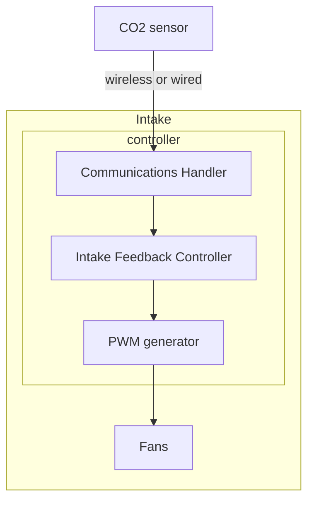
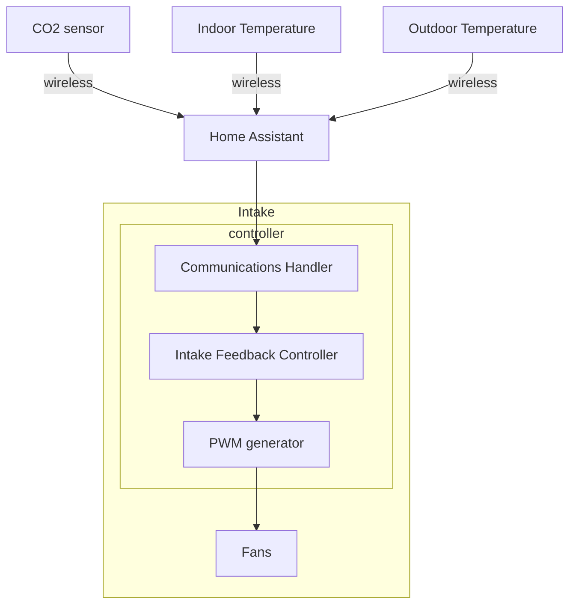

# Automation

## Control Requirements

The primary air handling issue is bringing enough air in to keep CO2 below a target value most of the time.
This only needs to be 'most of the time' because short term exposure to moderate CO2 levels is not a concern.

The secondary concern can be thought of as when would you open or close your windows: if the outside temperature is closer to a comfortable temperature than inside then the intake should increase the air flow. If it is colder or hotter outside than you want inside, then the intake should be at a minimum air flow to maintain CO2.

The tertiary (3rd) concern is the noise level, particularly at night. This could be managed by setting a maximum but we could get smarter, including with presence detectors (if no-one is in the room, ramp it up if needed).

[//]: # (The quaternary \(4th\) concern is energy but I think we can ignore it for now.)

## Control Considerations

* The main starting contenders for the control algorithm are bang-bang and PID
  * [Bang–bang control - Wikipedia](https://en.wikipedia.org/wiki/Bang%E2%80%93bang_control)
  This makes no use of the variable speed but is robust.
  * [Proportional–integral–derivative controller - Wikipedia](https://en.wikipedia.org/wiki/Proportional%E2%80%93integral%E2%80%93derivative_controller)
  This requires some tuning but we should be able to find good algorithms for PID tuning or variants of it. We can restrict the PID to only operate when the CO2 and temperature differentials are within fairly narrow ranges.
* Over-rides
  * Physical at the device - at very least it shouldn't be too painful to turn it off then on again. I.e., it should come up to a known state or the state it was last in.
  * Luxury - a manual speed control knob in over-ride mode
* Upper limit for noise
  * Limit more at night?
* Should any of the sensors be on the intake?
* Although the key parameter is total air flow, it may be beneficial to control the speeds of the fans independently because
  * on the Nukit model, two fans are put in series. The second fan should probably be running at a higher speed than the first for optimal efficiency and airflow for given noise level
  * spreading the fan speeds enables spreading the frequency components in the noise spectrum. This *may* reduce the annoyance level of the noise
  * if the fan speeds are very close, they can create beats that can be quite annoying.

## Local Control Option

Here the controller manages the fan speed based on CO2 sensor input reaching it directly via a wired or wireless link. The pulse width modulator (PWM) is likely to be the same module as the feedback controller.

## Home Assistant Option

## Pros and Cons

| Issue | Local | Home Assistant |
| ----- | ----- | -------------- |
| System independence | Independent of other hardware and software setups | Dependent on Home Assistant eco-system requiring hardware and software setup.  |
| Potential Customer base | Wide | Existing HA users only |
| Ease of development | Control algorithm tuning may be difficult | Relatively easy |
| Integration of indoor/outdoor temperature differential | Harder | Easier |
| Data logging for optimization | Harder | Already available as part of HA |

@Doug suggests we consider taking both approaches, possibly starting with the HA one as this should be faster to develop although it does require the developers to have an HA setup. The local approach could have a fairly simple state machine controller.
